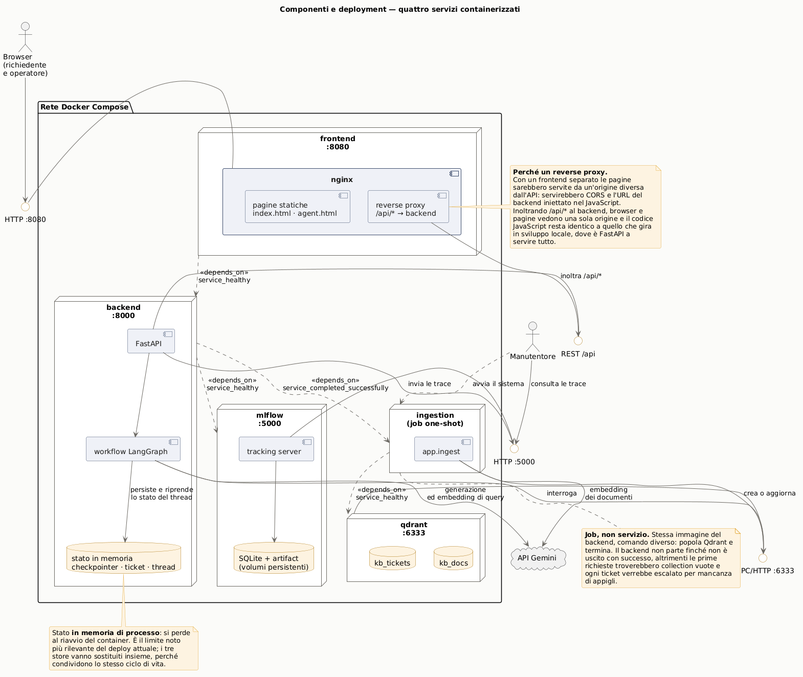
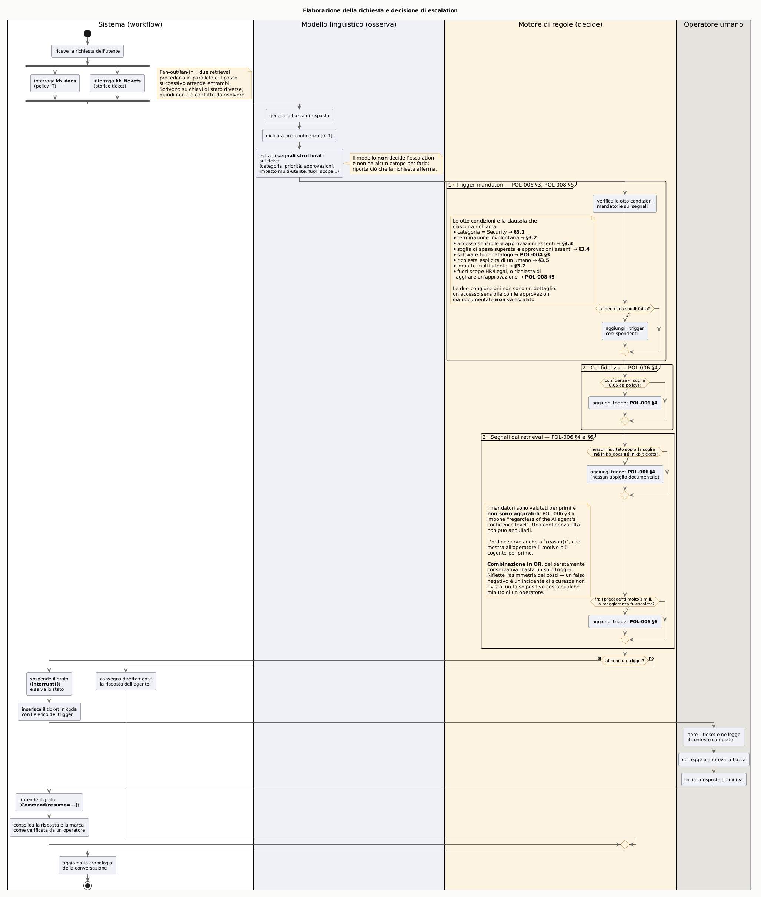
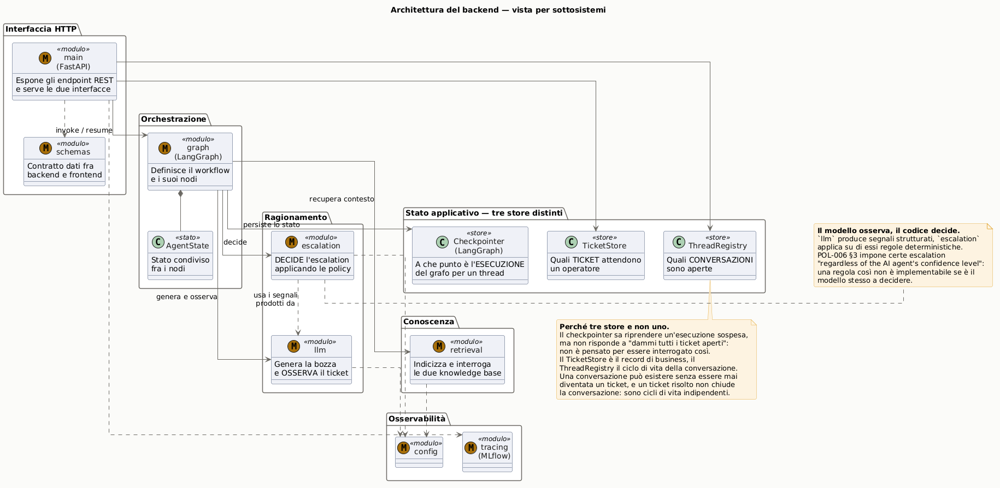
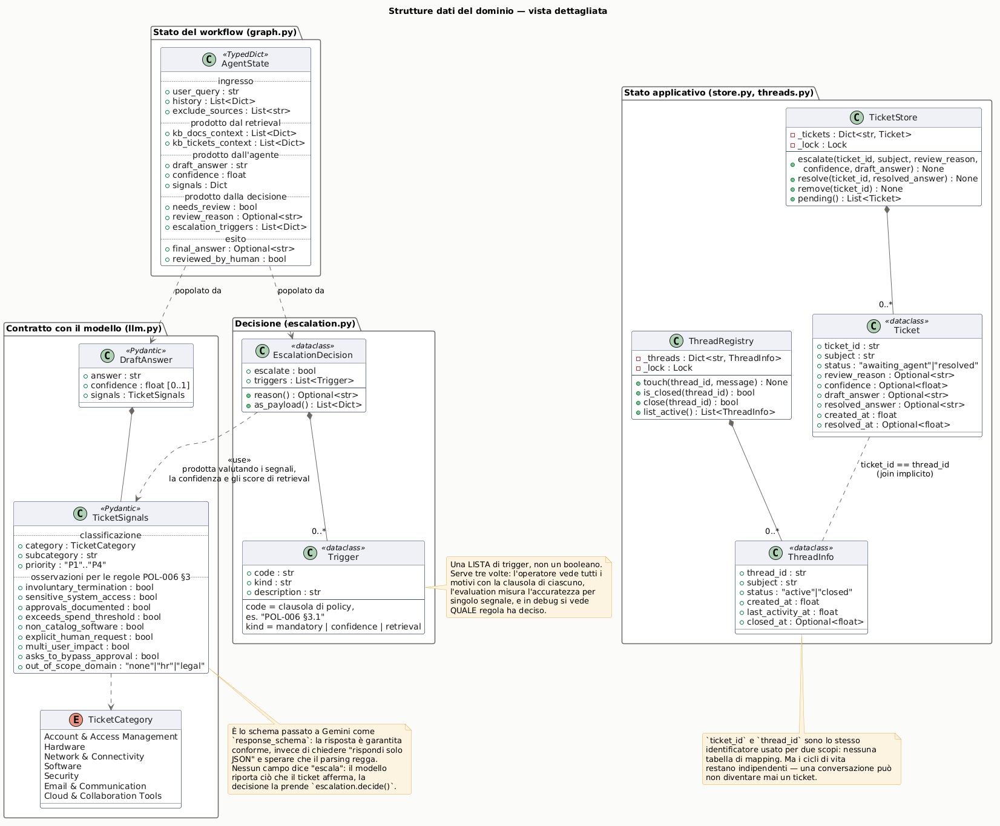
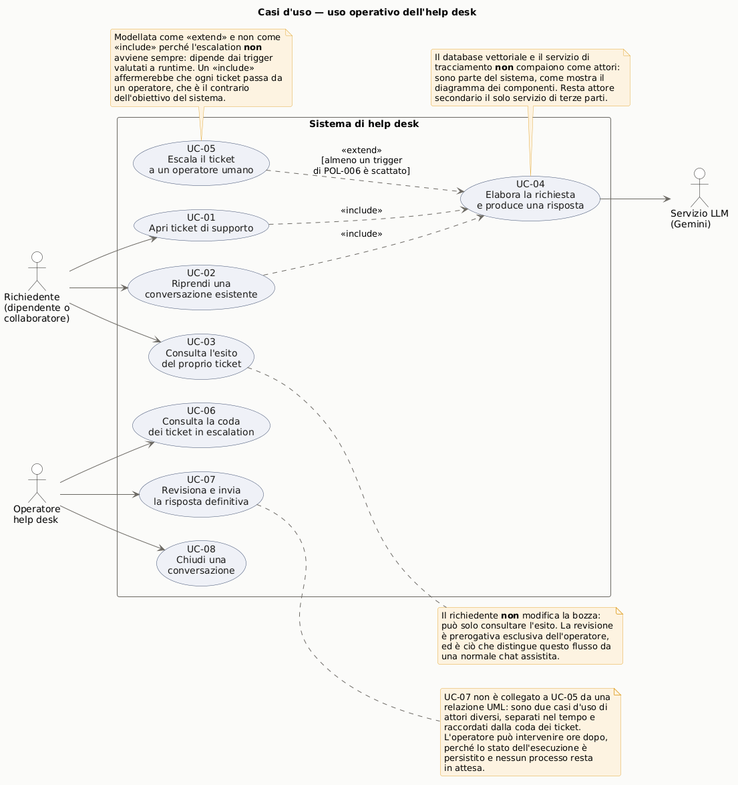
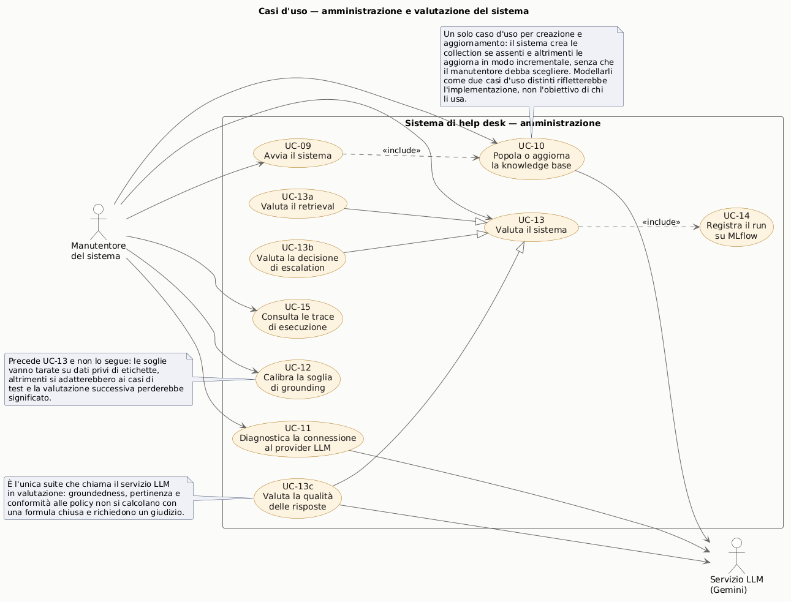
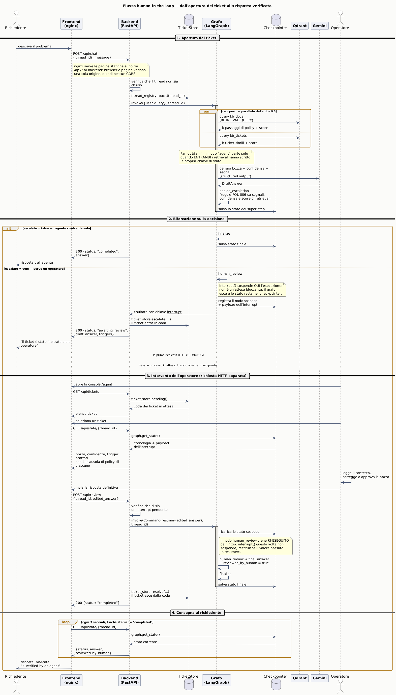

# Help Desk — prototipo HITL con LangGraph

Prototipo di sistema di help desk IT per un'azienda informatica fittizia
(volutamente senza nome). Un agente AI risponde alle richieste di supporto;
quando l'argomento è sensibile (sicurezza, accessi) o il modello dichiara
bassa confidenza, il ticket viene **escalato** a un operatore umano, che lo
vede in una console dedicata con tutto il contesto e può correggere/approvare
la risposta prima che venga inviata all'utente.

**Lingua del sistema: inglese.** Prompt del modello, interfacce utente e
operatore, messaggi generati dal backend sono tutti in inglese, coerentemente
con la knowledge base (policy + storico ticket) anch'essa in inglese. I
commenti nel codice e questo README restano in italiano: sono
documentazione per chi sviluppa il progetto, non output del sistema stesso.

Stack: **FastAPI** (backend, un solo processo per ora) + **LangGraph**
(orchestrazione con interrupt/resume) + **HTML/JS vanilla** (due interfacce,
nessun framework/build step).

> Progetto iterativo: questo README descrive lo stato attuale. Il retrieval
> sulle due knowledge base è **reale** (Qdrant locale, indice costruito dai
> file in `app/knowledge_base/`). La logica di decisione dell'escalation è
> ancora quella "semplice" del prototipo iniziale — vedi la sezione
> "Roadmap" in fondo.

## Avvio con Docker Compose (modalità consigliata)

```
docker compose up --build
```

Prima serve il file di configurazione: copia `.env.example` in `.env` e
valorizza `GEMINI_API_KEY`. Il comando di copia dipende dalla shell —
`cp .env.example .env` su macOS e Linux, `copy .env.example .env` sul prompt
dei comandi di Windows.

| Servizio | URL | Ruolo |
|---|---|---|
| **frontend** (nginx) | http://localhost:8080/ | interfaccia utente |
| | http://localhost:8080/agent | console operatore |
| **backend** (FastAPI) | http://localhost:8000/docs | API e grafo LangGraph |
| **qdrant** | http://localhost:6333/dashboard | database vettoriale |
| **mlflow** | http://localhost:5000 | trace delle esecuzioni |

Sequenza di avvio, garantita dalle condizioni in `depends_on`:

```
qdrant (healthy) ──▶ ingestion (completato) ──▶ backend (healthy) ──▶ frontend
mlflow (healthy) ──────────────────────────────▶
```

**Il job di ingestion.** Gira a ogni `docker compose up`, prima del backend:
crea le collection se non esistono, altrimenti le **aggiorna in modo
incrementale**. Ogni punto porta nel payload l'hash del testo embeddato e
della configurazione di embedding, quindi al riavvio si ri-embeddano solo i
chunk nuovi o modificati e si cancellano quelli spariti dalla sorgente. Senza
modifiche alla knowledge base il costo in chiamate all'API è **zero** (invece
di 168 embedding a ogni avvio). Cambiare modello o dimensione dell'embedding
invalida gli hash e forza la ricostruzione, che è il comportamento corretto:
vettori di provider diversi vivono in spazi incompatibili.

Il backend non parte finché l'ingestion non è uscita con successo
(`condition: service_completed_successfully`): senza quel vincolo le prime
richieste troverebbero collection vuote e ogni ticket verrebbe escalato per
"retrieval senza appigli".

**Perché il frontend è nginx con reverse proxy.** Separando il frontend in un
servizio a sé, le pagine sarebbero servite da un'origine diversa da quella
dell'API: CORS da configurare e URL del backend da iniettare nel JavaScript.
Con nginx che inoltra `/api/` al backend, browser e pagine vedono una sola
origine e **il codice JavaScript resta identico** a quello che gira in
sviluppo locale, dove è FastAPI a servire tutto.

## Avvio locale senza Docker

```
uv sync                     # oppure: pip install -r requirements.txt
uv run uvicorn app.main:app --reload
```

- `http://localhost:8000/` — interfaccia **utente**
- `http://localhost:8000/agent` — interfaccia **operatore**

In locale FastAPI serve anche le pagine statiche e `app/retrieval.py`
indicizza automaticamente all'import (`AUTO_INDEX=true` di default), quindi
non serve lanciare l'ingestion a mano. Il file `.env` viene letto
automaticamente: nessuna variabile da esportare a mano, su nessuna shell. Qdrant gira in modalità *embedded*
(`QDRANT_PATH`, un indice su disco) e MLflow scrive su `./mlruns`: nessun
servizio esterno da avviare.

Funziona subito senza chiave API, in modalità mock. Prova questo scenario
end-to-end:
1. Da `/`, scrivi "I clicked a phishing link and entered my password" → il
   ticket va in escalation, l'utente vede un messaggio di attesa.
2. Apri `/agent`: il ticket è in coda, con l'elenco dei trigger che l'hanno
   causato e la clausola di policy di ciascuno.
3. Modifica o approva la bozza, invia.
4. Torna sulla scheda utente: entro ~3 secondi (polling) compare la risposta,
   marcata "✓ verified by an agent".

## Gestione delle dipendenze: uv

`pyproject.toml` dichiara le dipendenze, `uv.lock` fissa le versioni esatte ed
**è versionato**: è ciò che rende identico l'ambiente tra la macchina di
sviluppo e i container. Le immagini usano `uv sync --frozen`, che fallisce se
il lock non è allineato al `pyproject` invece di risolvere silenziosamente
versioni diverse da quelle testate.

`matplotlib`, usata solo da `analysis/eda.py`, sta in un extra `analysis` e
non entra nell'immagine del backend:

```bash
uv sync --extra analysis && uv run python analysis/eda.py
```

## Architettura del grafo

```
           ┌──────────────────┐
    ┌─────▶│ retrieve_kb_docs  │────┐
    │      └──────────────────┘    │
  START                             ▼           escalate=False
    │      ┌─────────────────────┐ ┌───────┐   ┌──────────────────┐   ┌──────────┐
    └─────▶│ retrieve_kb_tickets │▶│ agent │──▶│ decide_escalation │──▶│ finalize │──▶ END
           └─────────────────────┘ └───────┘   └──────────────────┘   └──────────┘
                                                      │ escalate=True      ▲
                                                      ▼                    │
                                               ┌────────────────┐          │
                                               │ human_review    │─────────┘
                                               │ (interrupt())   │
                                               └────────────────┘
```

- **`retrieve_kb_docs` / `retrieve_kb_tickets`** — partono in parallelo da
  START (fan-out) e confluiscono su `agent` (fan-in): LangGraph aspetta che
  entrambi abbiano scritto la propria chiave di stato, dato che non c'è
  conflitto tra `kb_docs_context` e `kb_tickets_context`.
- **`agent`** — genera la bozza e **osserva** il ticket, restituendo segnali
  strutturati (categoria, priorità, approvazioni documentate, impatto
  multi-utente, richiesta esplicita di un umano...). Non decide l'escalation.
- **`decide_escalation`** — applica le regole di policy sui segnali. Vedi la
  sezione dedicata più sotto.
- **`human_review`** — nodo HITL: `interrupt()` sospende il grafo, il ticket
  entra nella coda dell'operatore con allegato l'elenco completo dei trigger.
- **`finalize`** — consolida la risposta definitiva e aggiorna la cronologia.

### Diagramma dei componenti



I quattro servizi containerizzati con le interfacce che espongono e le
dipendenze di avvio dichiarate nel compose. Due cose che il diagramma chiarisce
meglio di una descrizione a parole:

- **il browser parla con un solo servizio.** nginx serve le pagine e inoltra
  `/api/*` al backend, quindi non esiste traffico cross-origin: niente CORS da
  configurare, niente URL del backend da iniettare nel JavaScript, e il codice
  lato client resta identico a quello che gira in sviluppo locale.
- **`ingestion` è un job, non un servizio.** Stessa immagine del backend con un
  comando diverso: popola Qdrant e termina. Il backend non parte finché non è
  uscito con successo (`service_completed_successfully`), altrimenti le prime
  richieste troverebbero collection vuote e ogni ticket verrebbe escalato per
  mancanza di appigli.

È anche il diagramma in cui si vede il limite noto più rilevante: lo stato del
backend (checkpointer, ticket, thread) vive **in memoria di processo** e si
perde al riavvio del container.

### Diagramma di attività — la decisione di escalation



Le swimlane sono la ragione d'essere di questo diagramma: rendono verificabile
a colpo d'occhio che il modello linguistico occupa una fascia sola e stretta —
**genera la bozza, dichiara una confidenza, estrae i segnali** — mentre la
decisione di coinvolgere un umano avviene interamente nella corsia del motore
di regole. È l'affermazione "il modello osserva, il codice decide" resa
visibile invece che dichiarata.

Le tre partizioni corrispondono alle tre famiglie di segnali, valutate in
quest'ordine: mandatori (POL-006 §3, POL-008 §5), confidenza (§4), retrieval
(§4 e §6). L'ordine conta due volte: i mandatori sono **non aggirabili** da una
confidenza alta, e `reason()` mostra all'operatore il motivo più cogente per
primo.

### Diagrammi delle classi

Due viste dello stesso backend, con livelli di dettaglio diversi perché
rispondono a domande diverse.



La **vista astratta** mostra come è organizzato il backend e quali
responsabilità ha ciascun sottosistema, omettendo di proposito attributi e
firme. Il messaggio che deve passare è la separazione fra i **tre store**:
sembrano ridondanti e non lo sono. Il checkpointer sa riprendere
un'esecuzione sospesa ma non risponde a "dammi tutti i ticket aperti"; il
`TicketStore` è il record di business; il `ThreadRegistry` è il ciclo di vita
della conversazione. Una conversazione può esistere senza diventare mai un
ticket, e risolvere un ticket non chiude la conversazione: fonderli sarebbe
l'errore architetturale più facile da commettere qui.

Si vede anche la separazione fra `llm` (osserva) ed `escalation` (decide).



La **vista dettagliata** riporta attributi e firme delle strutture dati che
attraversano il sistema, presi dal codice. Tre punti da notare:

- `TicketSignals` è lo schema passato a Gemini come `response_schema`, quindi
  la risposta è garantita conforme. **Nessuno dei suoi campi dice "escala"**:
  il modello riporta ciò che il ticket afferma, la decisione è di
  `escalation.decide()`.
- `EscalationDecision` contiene una **lista di `Trigger`**, non un booleano.
  Serve tre volte: l'operatore vede tutti i motivi con la clausola di
  ciascuno, l'evaluation misura l'accuratezza per singolo segnale, e in debug
  si vede quale regola ha deciso.
- `AgentState` è diviso per fase (ingresso, retrieval, agente, decisione,
  esito): rende visibile quale nodo popola cosa.

Restano fuori i moduli senza stato (`retrieval`, `tracing`, `config`), che
compaiono nella vista astratta, e i modelli di richiesta/risposta HTTP, che
sono contratto di trasporto e non logica di dominio.

### Diagrammi dei casi d'uso

Due diagrammi separati, perché il sistema ha due insiemi di attori con
frequenze d'uso e cicli di vita diversi: chi lo **usa** a runtime e chi lo
**gestisce e valuta**. Mescolarli avrebbe prodotto un unico diagramma
illeggibile in cui le due prospettive si confondono.



Nel diagramma operativo la relazione da guardare è
`UC-05 ..> UC-04 : «extend»`. L'escalation è modellata come **estensione** e
non come inclusione perché non avviene sempre: dipende dai trigger valutati a
runtime. Un `«include»` affermerebbe che ogni ticket passa da un operatore,
cioè l'opposto dell'obiettivo del sistema.

Due cose che il diagramma dice e che vale la pena notare: il richiedente
**non** modifica la bozza (può solo consultarne l'esito — la revisione è
prerogativa esclusiva dell'operatore, ed è ciò che distingue questo flusso da
una normale chat assistita); e UC-07 non ha alcuna relazione UML con UC-05,
perché sono casi d'uso di attori diversi, separati nel tempo e raccordati
soltanto dalla coda dei ticket.



Nel diagramma amministrativo le tre suite di valutazione sono modellate come
**generalizzazioni** di UC-13, non come inclusioni: sono modi alternativi di
raggiungere lo stesso obiettivo, non parti obbligatorie di esso. E UC-12
(calibrazione) precede UC-13 e non lo segue, perché le soglie vanno tarate su
dati privi di etichette: tararle sui casi di test renderebbe la valutazione
successiva priva di significato.

### Diagramma di sequenza del flusso HITL



Il diagramma (sorgente PlantUML in `docs/diagrams/hitl_sequence.puml`) mostra
il meccanismo centrale del sistema: un ticket escalato attraversa **due
richieste HTTP indipendenti**, separate da un intervallo di durata arbitraria,
senza che alcun processo resti in attesa nel frattempo.

Le tre cose da guardare:

1. `interrupt()` nel nodo `human_review` **non è un'attesa bloccante**: il
   grafo esce, lo stato resta nel checkpointer e la prima richiesta HTTP si
   conclude normalmente.
2. Tra la fine di `POST /api/chat` e l'arrivo di `POST /api/review` il sistema
   non tiene niente in memoria di processo per quel ticket, se non i record di
   lettura in `TicketStore`. È ciò che permette all'operatore di intervenire
   ore dopo.
3. Alla ripresa, il nodo `human_review` viene **ri-eseguito dall'inizio**:
   questa volta `interrupt()` non sospende ma restituisce il valore passato in
   `Command(resume=...)`. Da qui il vincolo di non mettere effetti collaterali
   prima di quella chiamata.

Per rigenerarlo dopo una modifica:

```bash
java -jar plantuml.jar -tpng -tsvg -o . docs/diagrams/*.puml
```

## Logica di escalation multisegnale

`app/escalation.py`. Principio di progetto: **il modello osserva, il codice
decide**. POL-006 §3 impone certe escalation *"regardless of the AI agent's
confidence level"*: una regola così non è implementabile se è il modello
stesso a decidere: dev'essere codice ispezionabile che nessuna risposta del
modello può aggirare.

Tre famiglie di segnali, in ordine di forza:

| Famiglia | Fonte | Esempi di trigger |
|---|---|---|
| **Mandatori** | POL-006 §3, POL-008 §5 | categoria Security; terminazione involontaria; accesso a sistema sensibile senza doppia approvazione; spesa oltre soglia; software fuori catalogo; richiesta esplicita di un umano; impatto multi-utente; richiesta fuori scope da redirigere a HR/Legal |
| **Confidenza** | POL-006 §4 | confidenza dichiarata sotto **0.65** (valore preso alla lettera dalla policy) |
| **Retrieval** | POL-006 §4 e §6 | *grounding*: nessun passaggio di policy **né** ticket storico sopra la similarità minima; *precedente*: tra i ticket storici molto simili, la maggioranza fu escalata da un umano |

La combinazione è un **OR su tutti i trigger**, deliberatamente conservativa:
il costo degli errori è asimmetrico, non escalare un ticket che andava
escalato è molto più grave dell'inverso. Ogni trigger porta con sé la clausola
che lo giustifica (`POL-006 §3.1`, ...), il che serve sia all'operatore (vede
*perché* gli è arrivato quel ticket) sia all'evaluation (permette di misurare
l'accuratezza per singolo trigger, non solo quella complessiva).

> **Soglie da ritarare.** `ESCALATION_MIN_RETRIEVAL_SCORE` è oggi calibrata
> sull'embedding di fallback e va rimisurata sui punteggi reali di Gemini: le
> scale di similarità di due provider diversi non sono confrontabili. Con
> l'embedding di fallback la soglia scatta quasi sempre, producendo
> sovra-escalation — è atteso, non un bug.

## Provider: Google Gemini

Sia la generazione sia l'embedding passano da Gemini (SDK `google-genai`).

- **Generazione** — `gemini-3.7-flash` (configurabile). Usa lo **structured
  output nativo**: si passa uno schema Pydantic in `response_schema` e la
  risposta è garantita conforme, invece di chiedere "rispondi solo JSON" e
  sperare che il parsing regga. I parametri di sampling (`temperature`,
  `top_p`, `top_k`) non vengono impostati: sono deprecati sui modelli 3.x.
- **Embedding** — `gemini-embedding-001` con **task type asimmetrici**:
  `RETRIEVAL_DOCUMENT` in indicizzazione, `RETRIEVAL_QUERY` in query. Non è un
  dettaglio: i due tipi producono rappresentazioni pensate per i due lati
  della stessa ricerca, usarne uno solo degrada il ranking. Dimensione ridotta
  a 768 via Matryoshka, con **ri-normalizzazione L2 esplicita** — un vettore
  unitario a 3072 dimensioni non resta unitario se lo tronchi, e le soglie di
  escalation si basano sul confronto tra punteggi.

**Senza `GEMINI_API_KEY`** il sistema resta interamente eseguibile: risposte
mock ed embedding hash-based deterministico. Serve a sviluppare e testare
senza credenziali né costi, ma la qualità del retrieval non è rappresentativa.

I due provider producono spazi vettoriali incompatibili. `ensure_index()` se
ne accorge confrontando la dimensione della collection esistente con quella
del provider attivo, e **ricostruisce l'indice da zero** invece di fallire con
un errore oscuro a query time.

## Tracing con MLflow

`app/tracing.py`. All'avvio del backend `mlflow.langchain.autolog()` strumenta
l'esecuzione del grafo: ogni chiamata a `/api/chat` produce **una trace** con
uno span per nodo. Sopra l'autolog ci sono span espliciti su
`retrieval.kb_docs`, `retrieval.kb_tickets` ed `escalation.decide`, cioè
esattamente i punti i cui input/output servono all'evaluation.

Gerarchia prodotta da un'invocazione:

```
LangGraph
├── retrieve_kb_docs      └── retrieval.kb_docs
├── retrieve_kb_tickets   └── retrieval.kb_tickets
├── agent
├── decide_escalation     └── escalation.decide
├── route_after_decision
└── human_review
```

La configurazione attiva (modelli, soglie, top-k) viene loggata come parametri
di un run `service-startup`, così è sempre ricostruibile *con quale
configurazione* è stato prodotto un certo insieme di trace.

**MLflow è pensato come servizio a sé**: l'URI arriva da
`MLFLOW_TRACKING_URI` e in Docker Compose punterà al container dedicato. Se la
variabile non è impostata, MLflow scrive in locale su `./mlruns`. Il tracing
**non può far cadere una richiesta**: se il server è irraggiungibile, il
sistema continua a rispondere senza tracciare.

> Limite noto: quando il grafo si sospende su `interrupt()`, il tracer di
> MLflow emette un warning (`MlflowLangchainTracer has no attribute
> 'on_interrupt'`). È innocuo — la trace viene registrata comunque — ma
> segnala che l'integrazione non copre ancora nativamente gli interrupt di
> LangGraph.

## Retrieval: `app/retrieval.py`

Le due knowledge base vivono in `app/knowledge_base/`:

- `policies/POL-001..008-*.md` — le policy IT, indicizzate in Qdrant come
  collection `kb_docs`, **una sezione (`## Titolo`) per punto**: ogni chunk
  porta con sé il titolo del documento come contesto, così resta
  comprensibile anche isolato dal resto del file.
- `past_tickets.json` — lo storico ticket (108 record), indicizzato come
  collection `kb_tickets`, **un ticket per punto**. Viene embeddato solo il
  "lato problema" (oggetto + descrizione, ciò a cui una nuova richiesta
  somiglierà), mentre risoluzione/categoria/priorità/esito di escalation
  finiscono nel payload da mostrare come contesto una volta recuperato il punto.

L'intero corpus è **materiale simulato** costruito per questo progetto
universitario: policy e ticket sono scenari fittizi, non esiste distinzione
tra dati "reali" e "sintetici".

## Analisi esplorativa

`analysis/eda.py` produce `analysis/eda_report.md` e i grafici in
`analysis/figures/`. Copre la categorizzazione dei ticket, la distribuzione
della ground truth di escalation, la mappatura di ogni escalation storica sul
trigger POL-006 §3 corrispondente, i vincoli di lunghezza per l'embedding e
le indicazioni per la costruzione dei dataset di evaluation. Si rigenera con:

```bash
python analysis/eda.py
```

Il corpus è stato ampliato da 54 a 108 ticket mantenendo **identiche** la
distribuzione per categoria e per sottocategoria e la proporzione di
escalation per categoria (26/108, 24,1%). Le etichette di escalation sono
tutte riconducibili a un trigger di POL-006 §3, quindi il corpus resta
utilizzabile come ground truth per la parte deterministica della logica.

**Qdrant in modalità locale**: `QdrantClient(path="qdrant_data")` non
richiede un server esterno — scrive l'indice su disco nel processo stesso.
È lo stesso client che in un secondo momento punterà a un servizio Qdrant
containerizzato nel docker-compose finale (cambia solo l'argomento del
costruttore, `path=...` diventa `url=...`).

**Indicizzazione automatica**: al primo import di `app/retrieval.py` (quindi
al primo avvio del processo), se le collection non esistono ancora vengono
create e popolate leggendo i file bundled nel progetto. Le esecuzioni
successive riusano l'indice già su disco — nessuna re-indicizzazione ad ogni
avvio. Cancella la cartella `qdrant_data/` per forzare una re-indicizzazione
(utile se aggiorni i file della knowledge base).

**Embedding.** Il provider attivo è Gemini (vedi la sezione "Provider" più
sopra). Senza chiave API si ricade su un hashing trick deterministico che
cattura sovrapposizione lessicale ma non significato: fa girare la pipeline a
costo zero, ma non è rappresentativo. Un esempio concreto della differenza:
con il fallback la query "my laptop battery drains very fast" restituisce come
primo risultato un ticket di *furto* di laptop, agganciandosi al token
"laptop" e ignorando il senso della richiesta. È un buon caso di regressione
da riusare come baseline per verificare il guadagno degli embedding reali.

## Le due interfacce e come condividono il backend

Un solo processo FastAPI serve due pagine statiche distinte, entrambe sempre
attive:

| Interfaccia | Route | File | Ruolo |
|---|---|---|---|
| Utente | `GET /` | `app/static/index.html` | Apre un ticket, aspetta (con polling) che venga risolto |
| Operatore | `GET /agent` | `app/static/agent.html` | Vede la coda dei ticket in escalation, modifica/approva la risposta |

Condividono lo stesso set di endpoint API (`/api/chat`, `/api/review`,
`/api/state/{id}`) più uno nuovo, `/api/tickets`, usato solo dalla console
operatore per popolare la coda.

**Perché l'utente non modifica più direttamente la bozza** (comportamento
del prototipo precedente): ora l'escalation va a un *altro* attore (un
operatore, non l'utente stesso). L'interfaccia utente, quando il ticket è in
attesa, fa **polling** su `GET /api/state/{thread_id}` ogni 3 secondi finché
lo stato non diventa `"completed"`. Non ho introdotto WebSocket/SSE per ora
— è la prossima ottimizzazione naturale se serve una notifica istantanea
invece che un ritardo di qualche secondo.

## `TicketStore`: perché uno store separato dal checkpointer di LangGraph

`app/store.py` introduce un `TicketStore` in memoria, deliberatamente
**separato** dal checkpointer LangGraph (`InMemorySaver`). Sono due concetti
diversi:

- il **checkpointer** sa "a che punto è l'esecuzione del grafo per il
  thread X" — serve per riprendere un `interrupt()`, non per essere
  interrogato con query tipo "dammi tutti i ticket aperti" (LangGraph non è
  pensato per quel tipo di accesso);
- il **`TicketStore`** rappresenta il record di business "ticket" come lo
  vedrebbe un vero help desk: oggetto, stato, motivo di escalation. In un
  sistema reale sarebbe una tabella su database.

`ticket_id` coincide sempre con `thread_id`: sono lo stesso identificatore
usato per due scopi — nessuna tabella di mapping serve. `main.py` aggiorna
il `TicketStore` negli stessi punti in cui già parla al grafo (`chat()`
quando scatta l'escalation, `review()` quando l'operatore risolve).

## Struttura dei file

```
app/
├── main.py       # endpoint FastAPI, 2 route HTML, orchestrazione grafo + TicketStore
├── config.py      # configurazione centralizzata: modelli, soglie, URI servizi
├── graph.py       # StateGraph LangGraph: retrieval + agent + decisione + HITL + finalize
├── escalation.py   # logica multisegnale di escalation (regole di policy)
├── tracing.py      # setup del tracing MLflow
├── ingest.py       # entrypoint del job di ingestion (python -m app.ingest)
├── retrieval.py    # indicizzazione e query sulle due collection Qdrant
├── llm.py         # chiamata a Gemini (o mock): bozza, confidenza e segnali sul ticket
├── store.py        # TicketStore in-memory (coda per l'interfaccia operatore)
├── threads.py       # ThreadRegistry in-memory (tutte le conversazioni, attive/chiuse)
├── schemas.py       # modelli Pydantic (richieste/risposte + coda ticket + thread)
├── knowledge_base/
│   ├── policies/      # POL-001..008-*.md
│   └── past_tickets.json  # 108 ticket (corpus simulato unico)
└── static/
    ├── shared.css    # design tokens comuni alle due interfacce
    ├── index.html     # interfaccia UTENTE
    └── agent.html      # interfaccia OPERATORE

docker/
├── backend.Dockerfile   # backend e job di ingestion (stessa immagine)
├── frontend.Dockerfile  # nginx con le due pagine statiche
├── mlflow.Dockerfile    # tracking server
└── nginx.conf           # routing e reverse proxy verso il backend

analysis/
├── eda.py               # analisi esplorativa rigenerabile
├── eda_report.md        # report prodotto
└── figures/             # grafici

docker-compose.yml   # orchestrazione dei 4 servizi + job di ingestion
pyproject.toml       # dipendenze (uv)
uv.lock              # versioni fissate, versionato
```

## Riferimento API

| Endpoint | Metodo | Corpo | Usato da |
|---|---|---|---|
| `/api/chat` | POST | `{thread_id?, message}` | Utente |
| `/api/review` | POST | `{thread_id, edited_answer}` | Operatore |
| `/api/state/{thread_id}` | GET | — | Entrambe (polling utente, contesto ticket operatore) |
| `/api/tickets` | GET | — | Operatore (coda escalation) |
| `/api/threads` | GET | — | Entrambe (selettore utente, lista "conversazioni attive" operatore) |
| `/api/threads/{id}/close` | POST | — | Operatore (chiude una conversazione) |

## Selezione conversazioni (utente) e chiusura thread (operatore)

`app/threads.py` introduce un `ThreadRegistry`, un registro di **tutte** le
conversazioni (non solo quelle mai passate dalla coda di escalation),
separato — per lo stesso motivo del `TicketStore` — dal checkpointer
LangGraph.

- **Lato utente**: un selettore in `index.html` (`GET /api/threads`) elenca
  le conversazioni attive, permettendo di riprenderne una senza dover
  ricordare o salvare l'URL con `?thread=...`.
- **Lato operatore**: una sezione "Conversazioni attive" in `agent.html`
  elenca lo stesso insieme, con un tasto "Chiudi" per ciascuna (`POST
  /api/threads/{id}/close`). Da quel momento `POST /api/chat` rifiuta nuovi
  messaggi su quel `thread_id` con un 400 esplicito.

**Limite noto**: non c'è nozione di identità utente (nessuna
autenticazione) — le liste sono globali, non filtrate per "proprietario".
Da rivedere quando si introdurrà l'autenticazione.

**Limite noto (edge case)**: chiudere un thread ancora fermo su un
`interrupt()` (escalation non ancora risolta) lo rimuove dalla coda ticket,
ma il grafo sottostante resta "sospeso per sempre" nel checkpointer — non
esiste un modo pulito per annullare un interrupt pendente in LangGraph. Con
`InMemorySaver` non è un problema pratico (si perde comunque al riavvio), ma
va rivisto se si introduce un checkpointer persistente.

## Stato dei lavori

Gli step ancora aperti, con priorità e dettaglio operativo, sono in
**[`TODO.md`](TODO.md)**. In sintesi: il sistema è completo come architettura
ma tre verifiche sono ancora da fare (primo avvio reale di Docker, prima
esecuzione con una chiave Gemini vera, taratura delle soglie), e l'evaluation
è impostata ma non ancora eseguibile end-to-end.

## Evaluation

Quattro suite, deliberatamente separate: mediarle insieme nasconderebbe che un
retrieval mediocre e una logica di decisione sbagliata sono problemi diversi
con rimedi diversi.

| Suite | Dati | Cosa misura |
|---|---|---|
| **retrieval** | 135 ticket in leave-one-out | i chunk recuperati sono quelli giusti |
| **escalation-a** | 135 ticket, label `was_escalated_to_human` | se il modello **estrae bene i segnali** su cui operano le regole §3 (le regole sono fisse: se sbaglia, sbaglia la classificazione) |
| **escalation-b** | 23 casi scritti a mano | i criteri §4 e i redirect fuori scope, che lo storico non copre affatto |
| **answers** | campione di ticket | qualità delle risposte, giudicata da un LLM |

### Comandi

Tutti da eseguire nella **root del progetto**. Due modi:

**Nei container** (nessuna dipendenza da installare sull'host):

```bash
docker compose up -d qdrant mlflow          # servizi necessari
docker compose run --rm backend python -m evaluation.calibrate_thresholds
docker compose run --rm backend python -m evaluation.run_evaluation --suite all --sample 30
```

**Sull'host** (comodo per iterare). Il file `.env` viene letto
automaticamente da `app/config.py`, quindi non serve esportare nulla a mano —
basta aggiungerci le tre righe che indirizzano ai servizi in container:

```
QDRANT_URL=http://localhost:6333
MLFLOW_TRACKING_URI=http://localhost:5000
AUTO_INDEX=false
```

Poi, identico su Windows, macOS e Linux:

```
uv sync
uv run python -m evaluation.calibrate_thresholds
uv run python -m evaluation.run_evaluation --suite all --sample 30
```

> Quelle tre righe nel `.env` non disturbano i container: nel compose
> `QDRANT_URL` e `AUTO_INDEX` stanno in `environment:`, che ha la precedenza
> su `env_file:`, quindi dentro Docker continuano a valere i valori giusti
> (`http://qdrant:6333`).

### Opzioni

```bash
--suite retrieval|escalation-a|escalation-b|escalation|answers|all
--sample N          # sottocampione stratificato per sottocategoria (0 = tutti)
--judge-sample N    # quanti casi far giudicare dall'LLM (default 20)
--k N               # top-k per le metriche di retrieval (default 3)
--no-mlflow         # non registrare il run
```

### Ordine consigliato al primo giro

```bash
# 1. Taratura della soglia di grounding, PRIMA di misurare
python -m evaluation.calibrate_thresholds
#    -> scrivi il valore proposto in .env come ESCALATION_MIN_RETRIEVAL_SCORE

# 2. Retrieval: se va male, i segnali §4 dell'escalation sono rumore
python -m evaluation.run_evaluation --suite retrieval

# 3. Le due suite di escalation
python -m evaluation.run_evaluation --suite escalation --sample 40

# 4. Qualità delle risposte, su campione
python -m evaluation.run_evaluation --suite answers --judge-sample 20
```

### Valutazione RAG con RAGAS, eseguita tramite MLflow

`evaluation/ragas_suite.py` misura quattro criteri **standardizzati**,
separando ciò che riguarda il recupero da ciò che riguarda la generazione —
sono i due stadi che si guastano indipendentemente e richiedono rimedi diversi.

| Scorer | Stadio | Domanda |
|---|---|---|
| `ragas_context_precision` | recupero | i chunk recuperati sono pertinenti? |
| `ragas_context_recall` | recupero | il contesto copre quanto serve per rispondere? |
| `ragas_faithfulness` | generazione | ogni affermazione è sostenuta dal contesto? |
| `ragas_answer_relevancy` | generazione | la risposta affronta la domanda posta? |

```bash
uv sync --extra ragas
python -m evaluation.ragas_suite --sample 20
```

**Le due librerie fanno cose diverse e non alternative.** RAGAS fornisce le
*procedure di misura*; MLflow fornisce l'*infrastruttura di valutazione*.
Ogni metrica RAGAS è quindi avvolta in uno **scorer MLflow** e l'esecuzione
passa da `mlflow.genai.evaluate`, che si occupa di eseguire il sistema su ogni
riga, tracciarne l'esecuzione, applicare gli scorer e persistere tutto in un
run. Il guadagno rispetto a chiamare `ragas.evaluate` e registrare i risultati
a mano:

- ogni punteggio diventa un *assessment* attaccato alla traccia del singolo
  caso, quindi dall'aggregato si arriva al caso in un clic;
- gli scorer RAGAS e quelli nativi MLflow (`RetrievalGroundedness`,
  `RelevanceToQuery`) girano **nella stessa valutazione, sugli stessi dati**.
  Se concordano il giudizio è robusto rispetto all'implementazione; se
  divergono, il numero va preso con cautela — un'informazione che una sola
  libreria non può dare;
- il collegamento con versione dei prompt e configurazione è automatico.

Ogni scorer restituisce un `Feedback` con **motivazione e fonte**, non un
numero nudo: con metriche calcolate da un LLM, un punteggio anomalo può
dipendere dal sistema valutato o da un giudizio sbagliato, e senza la
motivazione i due casi sono indistinguibili.

`ragas_context_recall` è l'unico che usa un riferimento, e impiega
`resolution_summary`. È coerente con la scelta di **non** usarlo per la
correttezza della risposta: lì sarebbe un confronto fra testi con destinatari
diversi, qui serve solo a stabilire se il recupero ha trovato le informazioni
che il riferimento cita.

RAGAS sta in un extra opzionale perché richiede `langchain-community<0.4`, e
vincolare l'ambiente del servizio a quella versione per una libreria usata solo
in valutazione sarebbe un accoppiamento ingiustificato.

### Monitoraggio dei prompt

Il prompt è un parametro del sistema al pari di una soglia, ma è l'unico che
normalmente non compare quando si confrontano due esecuzioni. Se la qualità
delle risposte cambia, senza versionarlo non si distingue una variazione dovuta
alla riformulazione delle istruzioni da una dovuta al modello, ai dati o alle
soglie.

`app/prompts.py` registra i prompt nel **Prompt Registry di MLflow**:

- il prompt dell'agente viene registrato all'avvio del backend;
- quello del giudice all'avvio di una valutazione — una sua modifica sposta i
  punteggi senza che il sistema valutato sia cambiato, quindi va tracciata
  anch'essa;
- una **nuova versione nasce solo se il testo è effettivamente cambiato**:
  senza questo confronto ogni riavvio ne creerebbe una identica alla
  precedente, rendendo illeggibile la cronologia proprio quando serve;
- l'alias `production` punta sempre alla versione attiva;
- la versione finisce fra i parametri di ogni run, di avvio e di valutazione.

L'effetto pratico: affiancando due run in MLflow si vede subito se una
differenza nelle metriche coincide con un cambio di versione del prompt. È il
modo per rispondere alla domanda "la modifica *risolvi in un solo messaggio* ha
migliorato o peggiorato il sistema?" con un confronto invece che con
un'impressione.

### Scelte di progetto

**Il criterio di scelta della soglia è l'indice J di Youden** (Youden, 1950),
cioè la massimizzazione di `sensibilità + specificità - 1`, equivalente a
massimizzare la *balanced accuracy*. È il criterio standard per la selezione di
un punto di taglio su curva ROC e corrisponde al punto più distante dalla
diagonale del classificatore casuale. Assume però che i due errori pesino
ugualmente, ipotesi qui discutibile: l'opzione `--weight-ood` permette di
riflettere l'asimmetria reale dei costi, lasciando 0,5 come predefinito perché
è il criterio neutro e difendibile.

**La taratura ha un bias noto e accettato.** Le query "in dominio" usano gli
stessi campi che vengono indicizzati, quindi appartengono alla stessa
popolazione linguistica dei documenti: richieste reali, formulate in modo più
colloquiale, otterrebbero punteggi più bassi. La soglia che ne risulta è
perciò **ottimistica** e il sistema tende a escalare più del necessario. È un
*distribution shift* documentato e non corretto: la direzione dell'errore è
quella prudente, coerente con l'impostazione conservativa dell'escalation.

**La taratura non usa i casi di test.** `calibrate_thresholds.py` confronta la
distribuzione dei punteggi delle query in dominio con quelle fuori dominio
(`out_of_domain_queries.json`): nessuna delle due popolazioni ha etichette.
Tarare la soglia guardando i 23 casi etichettati e poi misurare su quegli
stessi casi significherebbe adattare i parametri al test set.

**Leave-one-out ovunque si usino i ticket come query.** Non solo perché una
query recupererebbe sé stessa, ma per una ragione più seria: il payload dei
ticket contiene `Escalated to a human agent: yes`, quindi senza esclusione il
modello leggerebbe nel contesto la risposta esatta alla domanda che gli stiamo
ponendo. Misureremmo la capacità di copiare, non di decidere.

**La metrica primaria non è l'accuracy.** Con il 24% di positivi, un sistema
che non escala mai otterrebbe il 76%. E gli errori non pesano uguale: un falso
negativo è un incidente di sicurezza non rivisto, un falso positivo è qualche
minuto di un operatore. Si guarda il **recall sulla classe "escalate"**, con
la precision come costo operativo e `F2` a riassumerle.

**Per il retrieval su `kb_tickets` le primarie sono `hit_rate@k` e `MRR`.**
Con la proxy "stessa sottocategoria è rilevante" una query ha fino a 9
documenti rilevanti: con k=3 la `recall@3` ha un tetto di 0,33 e un sistema
perfetto sembrerebbe pessimo. `capped_recall@k` normalizza sul massimo
ottenibile; la `recall` grezza resta nei report solo per trasparenza.

**Il giudice non confronta con `resolution_summary`.** Sono testi con
destinatari diversi: la risposta è per l'utente, il summary è una nota interna
scritta a posteriori. Una risposta ottima non gli somiglierà mai. I criteri
giudicati sono groundedness, relevance e **policy compliance**, quest'ultimo
scritto sul dominio perché è il più importante qui e nessuno scorer generico
lo copre.

**Ogni run salva una tabella per-caso** come artifact MLflow. Un
`hit_rate = 0,71` dice che qualcosa non va, non cosa: la tabella mostra quali
casi falliscono e con cosa vengono confusi.

## Diagnostica rapida

### Se Gemini non funziona: `app/diagnose.py`

```bash
# nel container (consigliato: è lì che il problema si manifesta)
docker compose run --rm ingestion python -m app.diagnose

# oppure in locale, dopo aver esportato le variabili
python -m app.diagnose
```

Esegue sei controlli in sequenza e si ferma al primo che fallisce, così si
capisce *quale strato* è rotto:

| # | Controllo | Isola |
|---|---|---|
| 1 | credenziali | chiave assente, vuota, con spazi o virgolette |
| 2 | SDK | `google-genai` non installato nell'immagine |
| 3 | DNS | il container non risolve il dominio |
| 4 | TCP :443 | firewall o proxy aziendale |
| 5 | modelli | nome di modello configurato inesistente |
| 6 | chiamate reali | chiave rifiutata, permessi, quota, dimensione vettori |

Serve perché tutte queste cause producono lo stesso sintomo apparente — "non
funziona con Gemini" — ma richiedono rimedi completamente diversi. Gli errori
noti dell'API vengono tradotti in un rimedio concreto invece di essere
riportati grezzi.


All'avvio, backend e job di ingestion loggano la credenziale attiva in forma
mascherata:

```
Credenziali Gemini — chiave attiva: AIzaSy...fXYZ (39 caratteri)
Modello: gemini-3.7-flash | embedding: gemini-embedding-001 (768 dim, provider gemini)
```

Se leggi `provider hashing-fallback` la chiave non è arrivata al processo, e
il messaggio distingue i due casi: variabile assente, oppure presente ma
vuota. Serve perché l'assenza di chiave **non produce un errore**: il sistema
ricade su embedding e risposte finte e continua a funzionare, con qualità
molto peggiore ma senza segnalare nulla.

Due trappole già incontrate, entrambe risolte nel codice ma utili da
conoscere:

- **In Docker Compose, `environment:` sovrascrive `env_file:`.** Elencare una
  variabile in `environment:` con un default vuoto (`${VAR:-}`) significa
  scrivere attivamente una stringa vuota nel container ogni volta che
  l'interpolazione non trova il valore, mascherando un `.env` perfettamente
  corretto. Per questo chiave API, modelli e soglie arrivano da `env_file:`, e
  in `environment:` restano solo i valori che il deploy deve imporre
  (`QDRANT_URL`, `AUTO_INDEX`, `MLFLOW_TRACKING_URI`).
- **MLflow 3.x valida l'header Host.** Per difendersi dal DNS rebinding
  accetta di default solo `localhost` e IP privati, quindi rifiuta con 403 le
  chiamate che arrivano con `Host: mlflow:5000`, cioè tutte quelle interne al
  compose. Risolto con `--allowed-hosts` nel comando del server, elencando il
  nome del servizio con e senza porta (il confronto è esatto sulla stringa).

## Limiti noti

- **Il deploy Docker non è stato eseguito.** Dockerfile, `nginx.conf` e
  `docker-compose.yml` sono stati scritti e validati staticamente (sintassi
  YAML, grafo delle dipendenze, e `uv sync --frozen` provato davvero), ma
  nessun container è mai stato costruito o avviato. Le versioni delle immagini
  base e l'healthcheck di Qdrant — che usa il redirect bash su `/dev/tcp`,
  perché quell'immagine non include `curl` né `wget` — sono i punti più
  probabili da correggere al primo avvio reale.
- **Il percorso Gemini non è stato provato contro l'API vera**, per assenza di
  connettività verso `generativelanguage.googleapis.com` nell'ambiente di
  sviluppo. Il codice è scritto sulle firme reali dell'SDK `google-genai`, ma
  la prima esecuzione con una chiave valida è a tutti gli effetti un test da
  fare.
- **Le soglie di escalation non sono tarate.**
  `ESCALATION_MIN_RETRIEVAL_SCORE` è calibrata sull'embedding di fallback: con
  quello, scatta quasi sempre e produce sovra-escalation. Va rimisurata sui
  punteggi reali di Gemini.
- Quando il grafo si sospende su `interrupt()`, il tracer MLflow emette un
  warning (`MlflowLangchainTracer has no attribute 'on_interrupt'`): innocuo,
  la trace viene registrata comunque.
- Nessuna autenticazione: chiunque raggiunga `/agent` può risolvere ticket, e
  le liste di conversazioni sono globali.

## Estensioni minori già identificate

- **Persistenza reale**: sostituire `InMemorySaver` (grafo) e `TicketStore`
  (ticket) con storage persistente — vanno cambiati insieme, dato che
  condividono lo stesso ciclo di vita "si perde tutto al riavvio".
- **Notifica istantanea** invece del polling (WebSocket/SSE) sull'interfaccia utente.
- **Autenticazione dell'operatore**: oggi chiunque raggiunga `/agent` può
  risolvere ticket; in un sistema reale l'endpoint `/api/review` andrebbe
  protetto e si vorrebbe tracciare *quale* operatore ha risolto cosa.
