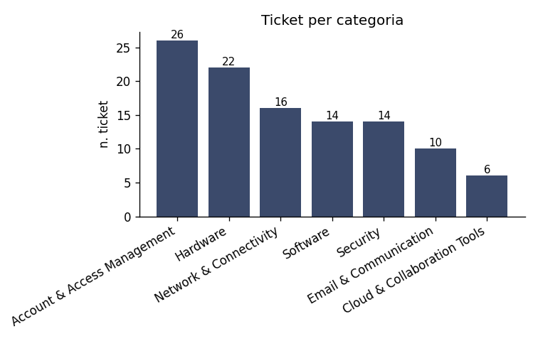
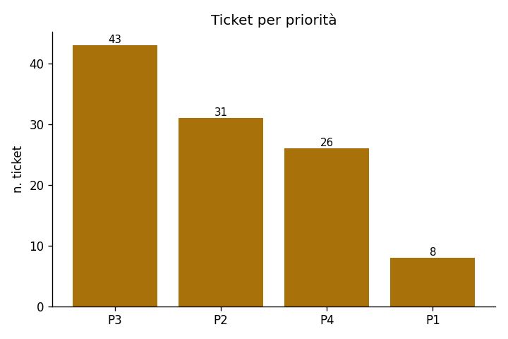
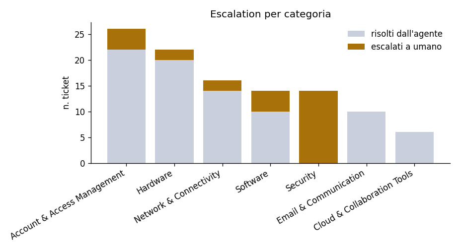

# EDA — knowledge base help desk

> Generato da `analysis/eda.py`. Rigenerabile con `python analysis/eda.py`.

## 1. KB ticket storici

**108 ticket** in `past_tickets.json`. L'intero corpus è materiale simulato costruito per questo progetto: non esiste distinzione tra dati reali e sintetici, sono tutti dati di scenario trattati allo stesso modo.

### 1.1 Schema

Campi presenti in ogni record: `category`, `created_at`, `csat_score`, `department`, `description`, `escalation_reason`, `priority`, `requester_role`, `resolution_steps`, `resolution_summary`, `resolution_time_minutes`, `source_channel`, `status`, `subcategory`, `subject`, `tags`, `ticket_id`, `was_escalated_to_human`.

Il campo chiave per questo progetto è **`was_escalated_to_human`**: è la ground truth con cui misureremo l'accuratezza della decisione di escalation. `escalation_reason` ne spiega il motivo ed è utile per capire *quale* regola di policy ha innescato l'escalation.

### 1.2 Distribuzione per categoria

| Categoria | N | % sul totale | Escalati | % escalati |
|---|---|---|---|---|
| Account & Access Management | 26 | 24.1% | 4 | 15% |
| Hardware | 22 | 20.4% | 2 | 9% |
| Network & Connectivity | 16 | 14.8% | 2 | 12% |
| Software | 14 | 13.0% | 4 | 29% |
| Security | 14 | 13.0% | 14 | 100% |
| Email & Communication | 10 | 9.3% | 0 | 0% |
| Cloud & Collaboration Tools | 6 | 5.6% | 0 | 0% |

### 1.3 Distribuzione per sottocategoria

| Categoria | Sottocategoria | N | Escalati |
|---|---|---|---|
| Account & Access Management | Password Reset | 8 | 0 |
| Account & Access Management | New Account Provisioning / Access Request | 8 | 2 |
| Account & Access Management | Account Lockout / MFA | 6 | 0 |
| Account & Access Management | Offboarding | 4 | 2 |
| Hardware | Laptop/Desktop Malfunction | 8 | 0 |
| Hardware | Printer | 6 | 0 |
| Hardware | Peripheral Issues | 4 | 0 |
| Hardware | Hardware Replacement Request | 4 | 2 |
| Network & Connectivity | Wi-Fi Connectivity | 6 | 0 |
| Network & Connectivity | VPN Connection Issues | 6 | 2 |
| Network & Connectivity | Slow Network / Drive Access | 4 | 0 |
| Software | Software Installation Request | 6 | 2 |
| Software | Software License Request | 4 | 2 |
| Software | Application Crash/Error | 4 | 0 |
| Security | Phishing Report | 6 | 6 |
| Security | Suspected Malware | 4 | 4 |
| Security | Lost/Stolen Device | 4 | 4 |
| Email & Communication | Outlook Issues | 6 | 0 |
| Email & Communication | Distribution List / Calendar | 4 | 0 |
| Cloud & Collaboration Tools | SharePoint/OneDrive/Teams | 6 | 0 |

In totale **20 sottocategorie** distinte: una granularità utile come possibile filtro sui payload Qdrant, o come etichetta da far predire al modello per abilitare regole di escalation specifiche per dominio.

### 1.4 Priorità, stato, canale

**Priorità** — `P1`: 8, `P2`: 31, `P3`: 43, `P4`: 26

**Stato** — `Resolved`: 86, `Escalated_Resolved`: 20, `Escalated_Pending`: 2

**Canale** — `Self-Service Portal`: 32, `Chat`: 30, `Email`: 24, `Phone`: 22

**Reparto** — `Engineering`: 21, `Operations`: 15, `Marketing`: 15, `Finance`: 14, `Sales`: 13, `Human Resources`: 10, `Customer Support`: 10, `Legal`: 8, `Procurement`: 2

**Ruolo richiedente** — `Standard Employee`: 90, `Manager`: 14, `Director`: 4

## 2. Escalation: la ground truth per l'evaluation

**26 / 108 ticket escalati (24.1%)**. Classe positiva minoritaria con rapporto ~1:3.2.

### 2.1 Escalation per priorità

| Priorità | N | Escalati | % escalati |
|---|---|---|---|
| P1 | 8 | 8 | 100% |
| P2 | 31 | 14 | 45% |
| P3 | 43 | 3 | 7% |
| P4 | 26 | 1 | 4% |

### 2.2 A quale regola di policy corrisponde ogni escalation

POL-006 §3 elenca 8 trigger di escalation obbligatoria. Mappando ogni `escalation_reason` sul trigger corrispondente si vede quanto la ground truth sia spiegabile da regole deterministiche:

| Trigger POL-006 | N ticket |
|---|---|
| §3.1 security-classified | 14 |
| §3.4 spend threshold / non-catalog | 5 |
| §3.3 sensitive access, dual approval | 2 |
| §3.2 involuntary termination | 2 |
| non mappato | 2 |
| §3.7 multi-user / infrastructure | 1 |

Ticket escalati non riconducibili a un trigger §3: **2** (TCK-2026-00224, TCK-2026-00230).

> **Implicazione per l'evaluation.** Le etichette storiche sono quasi interamente spiegate dai trigger *deterministici* di POL-006 §3. Nessun ticket è etichettato come escalato per i criteri di POL-006 §4 (bassa confidenza del modello, retrieval senza risultati sopra soglia): è atteso, perché sono ticket storici gestiti da umani, non da un agente AI. Ne segue che **questo dataset da solo non può misurare la parte §4 della logica di escalation**: servirà un secondo set di casi costruito ad hoc.

### 2.3 Coerenza con le policy

POL-005 §8 impone escalation per **ogni** ticket Security. Ticket Security presenti: 14, di cui non escalati: **0** ✓ coerente.

## 3. Caratteristiche dei testi (vincoli per l'embedding)

Il testo che viene effettivamente embeddato per un ticket è il *lato problema* (`subject` + `description`), perché è ciò a cui somiglia una nuova richiesta in ingresso; la risoluzione finisce nel payload.

| Testo embeddato | min | mediana | media | max | max token stimati |
|---|---|---|---|---|---|
| ticket (subject+description) | 19 | 30 | 30 | 45 | ~58 |

**Policy**: 60 sezioni da 8 file.

| Testo embeddato | min | mediana | media | max | max token stimati |
|---|---|---|---|---|---|
| sezione di policy | 26 | 66 | 73 | 187 | ~243 |

> Entrambi i tipi di chunk restano ampiamente sotto il limite di **2048 token** per input di `gemini-embedding-001`: non serve alcuna strategia di troncamento o di sub-chunking.

## 4. KB policy

| File | Policy | Sezioni | Ha sez. Escalation Criteria |
|---|---|---|---|
| `POL-001-password-account-access.md` | POL-001 | 8 | sì |
| `POL-002-access-request-provisioning.md` | POL-002 | 8 | sì |
| `POL-003-hardware-issuance-replacement-repair.md` | POL-003 | 8 | sì |
| `POL-004-software-installation-licensing.md` | POL-004 | 7 | sì |
| `POL-005-security-incident-response.md` | POL-005 | 9 | sì |
| `POL-006-priority-sla-escalation.md` | POL-006 | 7 | sì |
| `POL-007-remote-access-vpn.md` | POL-007 | 7 | sì |
| `POL-008-acceptable-use-data-handling.md` | POL-008 | 6 | sì |

Tutte le policy espongono una sezione esplicita di criteri di escalation: sono le regole che la logica di decisione dovrà implementare, con **POL-006 come policy master** (dichiara esplicitamente di prevalere in caso di conflitto con le altre).

## 5. Indicazioni per i dataset di evaluation

Dall'analisi emergono tre vincoli di progettazione:

1. **Leakage.** Gli stessi ticket sono sia nella collection `kb_tickets` sia candidati come query di test: senza accorgimenti il retrieval recupererebbe il ticket identico a sé stesso. Va usato un approccio *leave-one-out*, escludendo a query time il `ticket_id` di origine.

2. **Numerosità.** Con 26 soli casi positivi, uno split train/test classico lascerebbe una manciata di positivi nel test set. Meglio valutare su tutti i ticket in leave-one-out, riportando le metriche anche stratificate per categoria.

3. **Copertura.** Serve un secondo dataset, scritto a mano, per i casi che i dati storici non coprono: richieste ambigue, fuori scope (POL-008 → HR/Legal), o senza alcun riscontro nelle due KB — cioè esattamente i casi in cui deve scattare POL-006 §4.

Metrica primaria suggerita per l'escalation: **recall sulla classe 'escalate'**. Il costo degli errori è asimmetrico — non escalare un ticket che andava escalato (falso negativo) è molto più grave dell'escalare un ticket che l'agente avrebbe potuto risolvere.
